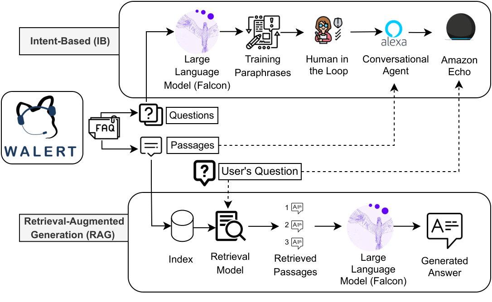

# Walert - A Conversational Agent

Teaser Video: https://drive.google.com/file/d/1Z2ZRveFYlX96v4ncq4RL-gzNbOlCJYGL/view?usp=sharing

Amazon Echo Demo Link: https://bit.ly/chiir24walertdemovideo

Demo Video Link (Intent-Based version deployed on Amazon Echo Device): https://bit.ly/WalertIntentDemo

Demo Video Link (Retrieval Augmented Generation based version): https://bit.ly/WalertRAGDemo

We built Walert, a conversational agent that answers FAQs about programs of study that are offered in the School of Computing Technologies at RMIT University. This intent-based approach, deployed in Amazon Echo device, was showcased as a demo at RMIT University’s Open Day in August 2023.

You can view our poster presented at CHIIR24: 



Note: This repository contains all utility code for 'Behind The Scenes' of Walert.

You will find in **quantitative_eval** folder all the required codes and files to rerun the experiments in the paper. 


# Citation
If you use or reference this work, please cite it as follows:
```
@inproceedings{10.1145/3627508.3638309,
author = {Pathiyan Cherumanal, Sachin and Tian, Lin and Abushaqra, Futoon M. and Magnoss\~{a}o de Paula, Angel Felipe and Ji, Kaixin and Ali, Halil and Hettiachchi, Danula and Trippas, Johanne R. and Scholer, Falk and Spina, Damiano},
title = {Walert: Putting Conversational Information Seeking Knowledge into Action by Building and Evaluating a Large Language Model-Powered Chatbot},
year = {2024},
isbn = {9798400704345},
publisher = {Association for Computing Machinery},
address = {New York, NY, USA},
url = {https://doi.org/10.1145/3627508.3638309},
doi = {10.1145/3627508.3638309},
booktitle = {Proceedings of the 2024 Conference on Human Information Interaction and Retrieval},
pages = {401–405},
numpages = {5},
keywords = {conversational information seeking, large language models, retrieval-augmented generation},
location = {<conf-loc>, <city>Sheffield</city>, <country>United Kingdom</country>, </conf-loc>},
series = {CHIIR '24}
}
```
